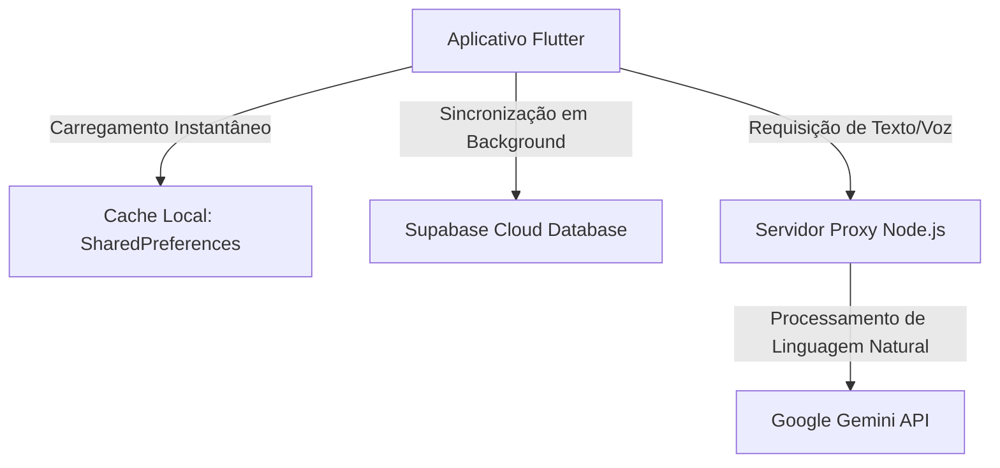

# Documentação Técnica Final: FitHub Água

**Ecossistema:** FitHub - Ecossistema de Aplicativos Fitness  
**Desenvolvedor:** Mateus Artur Santos
**Área de Atuação:** Hidratação Inteligente com Assistente de IA  
**Versão:** 1.0.0 (Release Final)

---

## 1. Visão Geral do Aplicativo

O **FitHub Água** é um assistente pessoal de hidratação premium baseado em **Inteligência Artificial conversacional** e integrado ao ecossistema FitHub. Diferente de soluções tradicionais focadas apenas em formulários estáticos, toda a interação do app é natural e humana: o usuário conversa com a IA para registrar água, calcular metas personalizadas e definir lembretes.

### Diferenciais e Funcionalidades Implementadas
1. **Chat de IA Centralizado:** O núcleo do aplicativo é um chat dinâmico. O usuário pode relatar consumo (*"bebi um copo de 300ml"*), pedir cálculos baseados no peso (*"peso 70kg, calcula minha meta"*) ou configurar alarmes (*"me lembre de 10 em 10 minutos"*). A IA interpreta esses comandos e atualiza os dados em tempo real.
2. **Dashboard de Alta Performance:** Um painel superior de vidro (`GlassContainer`) exibe o progresso diário em tempo real:
   * **Contagem Livre Além da Meta:** O volume diário bebido (`currentMl`) acumula de forma contínua e pode ultrapassar a meta (`goalMl`) com precisão (ex: `2500 / 2000 ml`), enquanto os indicadores circulares e lineares de progresso se mantêm em 100%.
   * **Reset Diário Automático:** O consumo zera instantaneamente para `0 ml` às 00:00h do novo dia (mesmo que o celular esteja offline), baseado em um cache de data inteligente.
3. **Microfone Inteligente com Conversão de Voz (Speech-to-Text):** Permite interagir sem digitar. O controle do microfone possui regras rígidas de UX:
   * Clicar no botão do microfone inicia a escuta (o botão fica azul brilhante).
   * Clicar novamente no microfone apenas **para de captar** o áudio, **sem enviar** a mensagem incompleta.
   * Começar a digitar texto no teclado ou apagar caracteres desativa o microfone automaticamente e libera a captação.
4. **Sistema Inteligente de Notificações Locais (Zoned Exact Alarms):**
   * **Pré-configuração Inicial:** Por padrão, os alarmes do aplicativo já vêm **pré-configurados com um intervalo de 1 hora (60 minutos)**. A contagem de tempo reinicia a cada consumo ou é recalculada dinamicamente caso o usuário solicite outro intervalo à IA.
   * **Sem Notificações Duplicadas:** O aplicativo utiliza um observer de ciclo de vida (`WidgetsBindingObserver`). As notificações do sistema operacional (som, vibração e banner) são **canceladas imediatamente enquanto o chat está aberto na tela**, pois a conversa flui de forma síncrona.
   * **Sempre Alerta em Segundo Plano:** Se o aplicativo for minimizado (segundo plano), o celular for bloqueado ou o aplicativo for completamente encerrado, os alarmes exatos são agendados a nível do sistema operacional para disparar nos horários programados.

---

## 2. Arquitetura de Dados e Sincronização

O aplicativo utiliza um modelo híbrido de banco de dados para garantir máxima velocidade de inicialização offline e sincronização em nuvem sem latência.

### Bancos de Dados Utilizados
O FitHub Água foi projetado sob o princípio de **Offline-First**, permitindo que o usuário visualize e interaja com suas metas de hidratação sem depender de internet ativa:
* **Supabase Database (PostgreSQL):** É o nosso **banco de dados central na nuvem**. Todo o histórico individual de consumo do usuário (`fithub_agua_records`) e as suas configurações de intervalo de lembrete (`fithub_agua_reminders`) são armazenados permanentemente nas tabelas do Supabase atrelados ao seu `user_id`. Isso garante que, se o usuário trocar de celular ou reinstalar o aplicativo, seus dados históricos serão mantidos e sincronizados.
* **SharedPreferences (Banco de Dados Local Key-Value Nativo):** É o nosso **banco de dados temporário local**. Optamos por SharedPreferences por ser uma solução extremamente leve e de altíssima performance para persistência chave-valor (com tempo de leitura de **0 milissegundos**). Isso evita a complexidade desnecessária e o consumo de recursos (bateria/processamento) que um banco de dados relacional pesado no celular (como SQLite ou Hive) traria para armazenar dados simples como ml bebidos, histórico de conversas e configurações de metas.



### Tabelas do Banco de Dados (Supabase)

#### 1. Histórico de Consumo (`fithub_agua_records`)
Armazena cada ml de água ingerido individualmente pelo usuário para fins de auditoria e cálculo diário.
```sql
create table public.fithub_agua_records (
  id uuid default gen_random_uuid() primary key,
  user_id uuid references auth.users(id) on delete cascade not null,
  amount_ml integer not null,
  recorded_at timestamp with time zone default timezone('utc'::text, now()) not null
);
```

#### 2. Lembretes e Intervalos (`fithub_agua_reminders`)
Armazena a configuração de tempo entre mensagens periódicas solicitada pelo usuário no chat.
```sql
create table public.fithub_agua_reminders (
  id uuid default gen_random_uuid() primary key,
  user_id uuid references auth.users(id) on delete cascade not null,
  interval_minutes integer not null,
  is_active boolean default true not null,
  created_at timestamp with time zone default timezone('utc'::text, now()) not null
);
```

### Estratégia de Funcionamento Offline (Offline-First)
* **Como funciona o app sem Internet:**
  * O aplicativo carrega imediatamente todos os dados do banco local (SharedPreferences): o histórico do chat de conversas anteriores, a meta diária calculada e a quantidade de água bebida hoje.
  * O usuário pode continuar registrando seu consumo de água de forma manual se desejar, e o dashboard do app atualizará reativamente as barras de progresso localmente na hora.
  * **Limitação de IA Offline:** A Inteligência Artificial (Gemini) requer conexão ativa com a internet para processar as mensagens. Caso o usuário envie uma mensagem de texto ou comando de voz enquanto estiver offline, o aplicativo gerenciará a falha de conexão de forma amigável, informando que a IA não pode responder sem internet, mas mantendo todo o resto do app funcional.

### Como funcionam as Mensagens Programadas (Lembretes)
* **Pre-programadas e Sem Custo de API:**
  * As notificações locais periódicas de hidratação **não realizam nenhuma chamada ou requisição à API de IA quando disparam**. 
  * Fazer uma requisição à IA para cada lembrete a cada hora (ou minuto) estouraria rapidamente a cota da API (rate limits) e geraria custos operacionais desnecessários.
  * Em vez disso, o aplicativo possui uma coleção rica e predefinida de frases motivacionais de hidratação salvas localmente no código do app.
  * Quando o timer interno do aplicativo ou os alarmes do sistema operacional (`Android AlarmManager`) despertam, o aplicativo seleciona aleatoriamente um desses templates e exibe diretamente como balão no chat ou como notificação push na barra do celular.
  * **Resultado:** O sistema de lembretes funciona **100% offline**, possui **custo zero de requisições de API** e responde com estabilidade máxima de segundo plano.

---

## 3. Padrão Arquitetural (MVVM)

O aplicativo foi estruturado utilizando o padrão de arquitetura **MVVM (Model-View-ViewModel)** unificado à gerência de estado reativa do Provider:

* **Model (Modelo):** Representado pelas tabelas e estruturas de dados do Supabase e do cache local (`fithub_agua_records`, `fithub_agua_reminders`), contendo os dados brutos de consumo, data e configurações.
* **View (Visão):** Composta pelas telas e componentes de interface do aplicativo (`FitHubAguaApp`, `AuthScreen`, `MainScreen`, `_ChatBubble`, `GlassContainer`). As views são passivas e reagem de forma instantânea às mudanças de estado notificadas pelo ViewModel.
* **ViewModel (Visão-Modelo):** Representado pela classe `HydrationState` (que estende `ChangeNotifier`). É o cérebro da aplicação. O ViewModel encapsula toda a lógica de negócios:
  1. Gerencia os carregamentos e gravações no banco de dados local e remoto.
  2. Orquestra a gravação de áudio do microfone e as requisições de texto à IA.
  3. Controla a lógica de metas, limites excedidos e o algoritmo de reset diário.
  4. Dispara o método `notifyListeners()`, que força a View a se re-renderizar de forma reativa e automática sempre que houver mudanças.

---

## 4. Stack Tecnológica Completa

* **Frontend & Lógica:** Flutter SDK 3.x / Dart.
* **Gerenciador de Estado:** `ChangeNotifierProvider` (Provider) para manter o estado unificado reativo na UI.
* **Autenticação:** Supabase Auth (fluxos integrados de Login, Registro de Conta e Validação de Sessão ativa).
* **Base de Dados:** Supabase Database (PostgreSQL) com persistência assíncrona.
* **Processamento de IA:** Google Gemini API integrando o modelo leve e ágil `gemini-1.5-flash` protegido por um proxy Express (Node.js).
* **Nativos (Android / iOS):**
  * `speech_to_text` (Microfone nativo para captação de voz).
  * `flutter_local_notifications` (Notificações locais de alta prioridade).
  * `flutter_timezone` & `timezone` (Configuração dinâmica de fuso horário local).
  * `shared_preferences` (Persistência em cache de chave-valor).

---

## 4. Recursos Nativos e Configurações do Sistema

### Manifesto Android (`AndroidManifest.xml`)
Para garantir o correto funcionamento das notificações em segundo plano profunda (Doze Mode) e após reinicializações, os seguintes elementos foram declarados formalmente:

```xml
<!-- Permissões Obrigatórias -->
<uses-permission android:name="android.permission.INTERNET" />
<uses-permission android:name="android.permission.RECORD_AUDIO" />
<uses-permission android:name="android.permission.POST_NOTIFICATIONS" />
<uses-permission android:name="android.permission.SCHEDULE_EXACT_ALARM" />
<uses-permission android:name="android.permission.USE_EXACT_ALARM" />
<uses-permission android:name="android.permission.RECEIVE_BOOT_COMPLETED" />
```

#### Para que serve cada permissão acima? (Explicação Simples)
* **`INTERNET` (Acesso à Internet):** Permite que o aplicativo se comunique com o banco de dados na nuvem (Supabase) para carregar/salvar seus dados e converse com o servidor da inteligência artificial (Gemini) para responder às suas mensagens.
* **`RECORD_AUDIO` (Gravação de Áudio):** Dá permissão para acessar o microfone do celular. É usado exclusivamente quando você toca no ícone de microfone para falar com a IA por voz.
* **`POST_NOTIFICATIONS` (Enviar Notificações):** Exigido no Android 13+. Permite que os alertas de hidratação (som, vibração e banner) apareçam no topo do seu celular.
* **`SCHEDULE_EXACT_ALARM` e `USE_EXACT_ALARM` (Agendamento de Alarmes Exatos):** Permitem disparar os alertas de hidratação com precisão cirúrgica de segundo, mesmo se o celular estiver em modo de descanso profundo ("Doze mode") com a tela bloqueada.
* **`RECEIVE_BOOT_COMPLETED` (Iniciar pós-reinicialização):** Permite que, caso o seu celular seja desligado ou reiniciado, o aplicativo reorganize e remarque automaticamente todos os seus lembretes programados assim que o aparelho ligar novamente.

<!-- Receivers para Despertar Lembretes -->
<receiver android:exported="false" android:name="com.dexterous.flutterlocalnotifications.ScheduledNotificationReceiver" />
<receiver android:exported="false" android:name="com.dexterous.flutterlocalnotifications.ScheduledNotificationBootReceiver">
    <intent-filter>
        <action android:name="android.intent.action.BOOT_COMPLETED"/>
        <action android:name="android.intent.action.MY_PACKAGE_REPLACED"/>
        <action android:name="android.intent.action.QUICKBOOT_POWERON" />
        <action android:name="com.htc.intent.action.QUICKBOOT_POWERON"/>
    </intent-filter>
</receiver>
```

### Configuração de Ícone Adaptativo
Os ícones do aplicativo utilizam o padrão moderno do Android 8.0+ para evitar distorções de tamanho, configurados no `pubspec.yaml`:
```yaml
flutter_launcher_icons:
  android: true
  ios: true
  image_path: "assets/fithub_logo.png"
  adaptive_icon_background: "#0F172A"
  adaptive_icon_foreground: "assets/fithub_logo.png"
  min_sdk_android: 21
```

---

## 5. Estrutura do Código-Fonte Principal

O código do aplicativo está estruturado sob a classe unificada de gerenciamento de estado `HydrationState`. Abaixo está a demonstração de dois métodos cruciais de controle de negócios implementados:

```dart
// Algoritmo de Reset Diário Automático no loadUserData
final todayStr = DateTime.now().toIso8601String().substring(0, 10);
final savedDate = prefs.getString('${userId}_lastSavedDate') ?? '';
if (savedDate == todayStr) {
  currentMl = prefs.getInt('${userId}_currentMl') ?? 0;
} else {
  currentMl = 0; // Novo dia detectado: zera o consumo
  await prefs.setInt('${userId}_currentMl', 0);
  await prefs.setString('${userId}_lastSavedDate', todayStr);
}

// Algoritmo de Consumo com Limites Livres (Excede a Meta)
Future<void> addWater(int amount) async {
  final userId = Supabase.instance.client.auth.currentUser?.id;
  if (userId != null && amount > 0) {
    try {
      await Supabase.instance.client.from('fithub_agua_records').insert({
        'user_id': userId,
        'amount_ml': amount,
      });
    } catch (e) {
      print("Erro ao salvar record no Supabase: $e");
    }
  }

  // Acumula de forma livre até o teto de 999.999 ml para permitir ultrapassar a meta
  currentMl = (currentMl + amount).clamp(0, 999999);
  notifyListeners();
  await _saveUserData();
  await _updateLastInteraction();
  
  // Zera e recomeça a contagem do lembrete periódico de hidratação
  NotificationService.scheduleReminder(reminderIntervalMinutes);
}
```

---

## 6. Instruções de Compilação Isolada (Build)

Como o diretório local do Windows possui caracteres especiais com acentos (`Desktop\app hidratação`), o Gradle pode apresentar erros de caminhos não-ASCII. Para contornar essa restrição do compilador Android de forma automatizada, foi criado um script robusto em PowerShell (`build_final.ps1`):

1. **Clonagem e Higienização:** O script copia automaticamente todo o código-fonte do projeto para um diretório temporário ASCII neutro (`C:\IsolatedBuildEnv\fithub_agua_app_temp`).
2. **Execução Isolada:** O Flutter executa o comando `flutter build apk --release` nesse ambiente limpo.
3. **Exportação Automática:** O APK compilado com sucesso (`app-release.apk`) é transferido de volta para a pasta de origem no desktop com o nome amigável `fithub_agua_app.apk`.

### Para gerar uma nova build a qualquer momento, execute no PowerShell:
```powershell
powershell -ExecutionPolicy Bypass -File .\build_final.ps1
```

---

## 7. Como Configurar as Tabelas no Painel do Supabase (Passo a Passo)

Caso as tabelas `fithub_agua_records` e `fithub_agua_reminders` ainda não apareçam criadas no seu painel online do Supabase, você pode criá-las em menos de 10 segundos seguindo estes passos simples:

1. Acesse o painel do seu projeto no Supabase: [ayvbtydubxcpevcxcoul](https://supabase.com/dashboard/project/ayvbtydubxcpevcxcoul)
2. No menu lateral esquerdo, clique no ícone do **SQL Editor** (um ícone de terminal com o símbolo `>_`).
3. Clique no botão **"New query"** (Nova consulta) no topo.
4. Cole o seguinte código SQL na caixa de texto:

```sql
-- Criando tabelas vinculadas ao ecossistema AHUB para o app de Hidratação

CREATE TABLE IF NOT EXISTS public.fithub_agua_records (
    id UUID DEFAULT gen_random_uuid() PRIMARY KEY,
    user_id UUID NOT NULL, -- FK referenciando a tabela de auth/users central do AHUB
    amount_ml INTEGER NOT NULL,
    recorded_at TIMESTAMP WITH TIME ZONE DEFAULT NOW()
);

CREATE TABLE IF NOT EXISTS public.fithub_agua_reminders (
    id UUID DEFAULT gen_random_uuid() PRIMARY KEY,
    user_id UUID NOT NULL,
    interval_minutes INTEGER NOT NULL,
    is_active BOOLEAN DEFAULT TRUE,
    created_at TIMESTAMP WITH TIME ZONE DEFAULT NOW()
);

-- Habilitando RLS (Row Level Security) para segurança dos dados
ALTER TABLE public.fithub_agua_records ENABLE ROW LEVEL SECURITY;
ALTER TABLE public.fithub_agua_reminders ENABLE ROW LEVEL SECURITY;

-- Políticas para fithub_agua_records
CREATE POLICY "Users can insert their own records"
ON public.fithub_agua_records FOR INSERT
TO authenticated
WITH CHECK (auth.uid() = user_id);

CREATE POLICY "Users can view their own records"
ON public.fithub_agua_records FOR SELECT
TO authenticated
USING (auth.uid() = user_id);

-- Políticas para fithub_agua_reminders
CREATE POLICY "Users can insert their own reminders"
ON public.fithub_agua_reminders FOR INSERT
TO authenticated
WITH CHECK (auth.uid() = user_id);

CREATE POLICY "Users can view their own reminders"
ON public.fithub_agua_reminders FOR SELECT
TO authenticated
USING (auth.uid() = user_id);

CREATE POLICY "Users can update their own reminders"
ON public.fithub_agua_reminders FOR UPDATE
TO authenticated
USING (auth.uid() = user_id);
```

5. Clique no botão azul **Run** (Executar) no canto inferior direito da tela.
6. **Pronto!** As tabelas e as regras de segurança serão criadas instantaneamente e o seu app funcionará em total harmonia e sincronia com a nuvem!
